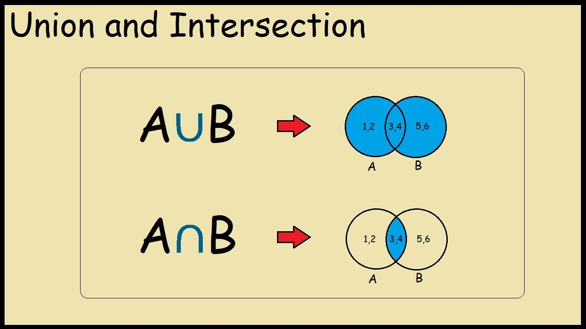

# Sets
Sets are another way to store data in python. What makes sets different between dictionaries, lists, and tuples are that they are unchangable, unordered, have no indexes, and have no duplicates. Sets are great for many things and can be used to find the difference between two sets or similarities between two sets. This can be done using the ***Union*** and ***Intersection*** methods. 

## Union
Union returns a set that contains all of the items from both sets, duplicates are not included. Union can be used using multiple sets, it can be used with 2 sets or even 10 sets. If an item is in more than one set, the union set will contain only one appearance of that item. A great use of this would be to fiddle out all of the duplicates in a list. If you compare two lists and want to get rid of duplicates in both lists, union will fix this.


## Intersection
Intersection returns a set that contains items that exist in both sets. For example, if you have a set of {1,2,3} and {3,4,5} it will return a set only containing 3. This function is great if for checking followers on multiple platforms for a company. Let say they wanted to check for all the people that followed them on multiple platforms. With Intersection, they can find all of these people easily.

## Python example of Intersection and Union
``` python
set_1 = {1,2,3,4,5,6,7,8}
set_2 = {4,5,6,7}

set_3 = set_1 & set_2 # Intersection 
set_4 = set_1 | set_2 # Union 

print(set_3) # Result: 4,5,6,7
print(set_4) # Result: 1,2,3,4,5,6,7,8

for i in set_4: # Result: 1,2,3,4,5,6,7,8
    print(i)
```



## Performance of Sets
|       Description         |      Python Code      |     Performance     | 
|      :-----------:        |     :------------:    |     :-----------:   |
|   Add value to set        |    set.add(value)     |         O(1)        |
|   Remove value from set   |    set.remove(value)  |         O(1)        |
|   Find value in set       |    if value in set:   |         O(1)        |
|   Loop through set and print value|    for i in set: <br> print(i)| O(n)|
|   Get length of the set   |    length = len(set)  |         O(1)        |

The performance of sets are really fast. With almost every function of O(1) time 
the processing is almost instantaneous.


## Problem to solve
Lets say you were asked by a company to find 2 things for their company. They want you to do certain things regarding their social media followers. These things include:
* Find out common customers on multiple social media platforms 
* Make one set that has all customers of social media platforms and no duplicates.
* Remove people from both sets since they need to be blocked.

Find out how to complete these tasks using sets. I will provide many things including a list of names for the platforms and templated functions. Here is the template to use:
``` python

```

You can check your code with the solution here: [Solution](SourceCodes/Set_solution.py)

[Back to Welcome Page](Welcome.md)